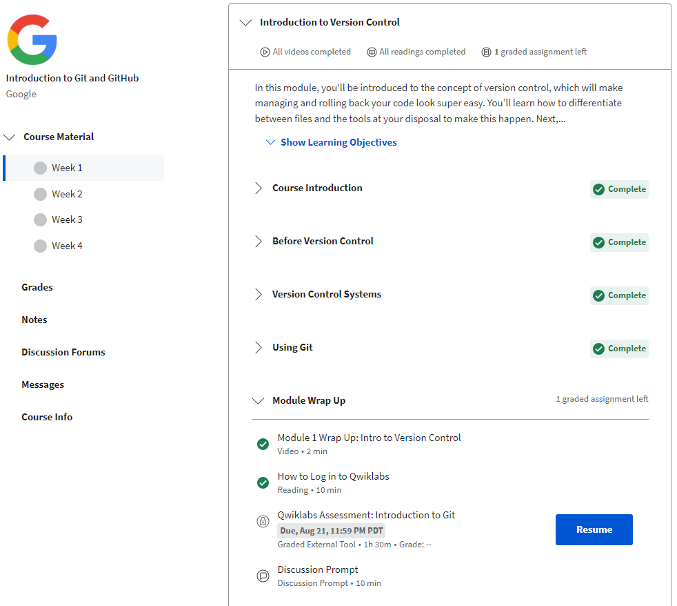

# kottans-frontend

## Git Basics

I've completed **Git та GitHub** block.
Before, I've used some basic git commands but haven't practised much.
While doing Coursera course [Introduction to Git and GitHub](https://www.coursera.org/learn/introduction-git-github), I learnt more about what Git is and why it is so widely used.

<details>
    <summary>Screenshots of Introduction to Git and GitHub</summary>
        
        

    
    
</details>

<details>
    <summary>Screenshots of learngitbranching</summary>
    [learngitbranching1](/git-screenshots/learngitbranching1.png)
    [learngitbranching2](/git-screenshots/learngitbranching2.png)
</details>


As a sum up, its main features are:

* tracking changes
* making updates
* getting updates
* undoing changes / rollbacks
* resolving conflicts
* branching and merging

Main git commands that I've practised by following the instructor on **Coursera** and by completing practice tasks on <https://learngitbranching.js.org/>:

```
git innit
git status
git add
git commit (-a -m)
git log (--graph --oneline / -p -2)
git checkout (-b)
git branch <name>
git push / pull
git fetch
git merge
```

## Linux CLI, and HTTP

Having completed [Linux Survival](https://linuxsurvival.com/), I've got a better understanding of how Linux operation system works and practised most usual commands:

```
cd
ls
mv
rm
pwd
mkdir
cp
chmod
kill
ps aux
```

The new thing for me was how '~' '.' '*' are used in different combinations.
<details>
    <summary>Screenshots of Linuxsurvival</summary>
    [Linuxsurvival1](/task_linux_cli/linux1.png)
    [Linuxsurvival2](/task_linux_cli/linux2.png)
    [Linuxsurvival3](/task_linux_cli/linux3.png)
    [Linuxsurvival4](/task_linux_cli/linux4.png)
</details>
<p></p>

Having read [HTTP: The Protocol Every Web Developer Must Know—Part 1](https://code.tutsplus.com/tutorials/http-the-protocol-every-web-developer-must-know-part-1--net-31177?ec_unit=translation-info-language) on HTTP protocol, I've deepened my understanding of how web apps interact with servers.
HTTP (which stands for Hypertext Transfer Protocol) has the version 1.1 and the newer and faster one - 2.0. The difference and the advance of the latter lies in the ability of the client to request style and script simultaneously, and of the server to respond with style and script simultaneously as well. While version 1.1 allows single request and single response.
If I were asked what HTTP request consists of, I'd mention request line (with request verbs, path, and HTTP version), headers (which has additional information about the request), and body (which can be optional). I didn't know that there're so many different headers and that they also can be customized.
As for responses, they look similar to requests, they also have different headers, and they also have status line with status codes like 1xx / 2xx / 3xx / 4xx / 5xx .

I'd worked with request-response pair before, while creating a web app with Flask framework, so I'd be interested to see this interaction while using other frameworks, e.g. Node.js.

The most interesting from [HTTP: The Protocol Every Web Developer Must Know—Part 2](https://code.tutsplus.com/tutorials/http-the-protocol-every-web-developer-must-know-part-2--net-31155?ec_unit=translation-info-language#persistent-connection) was to find out more about the security of the web apps.
In modern web browsers a secure version of HTTP is used, which is HTTPS. It inserts an extra layer before TCP/IP, which is SSL(Secure Sockets Layer) or TSL (Transport Layer Security).
